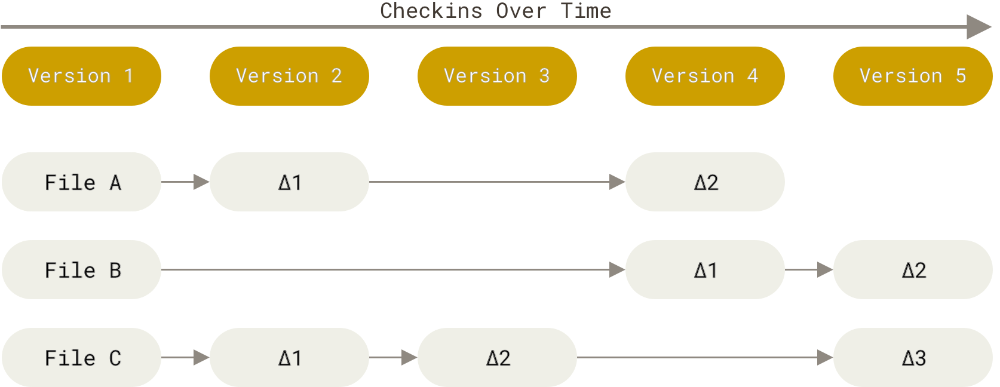
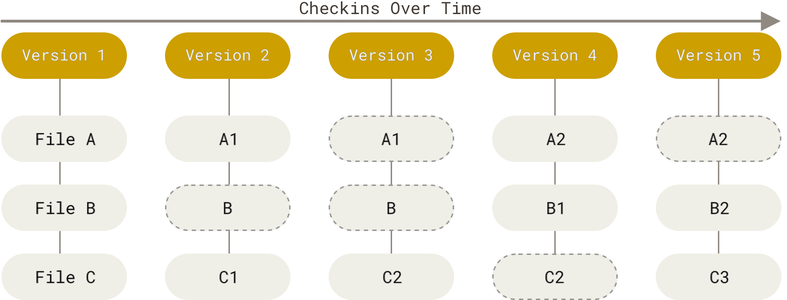

# Git là gì? Các câu lệnh cơ bản

Trước khi đi đến khái niệm của Git, chúng ta cần biết về kiểm soát phiên bản - version control

## Version control là gì? Tại sao chúng ta cần quan tâm?
Version control là một hệ thống ghi lại thay đổi một tệp hoặc một tập hợp các tệp theo thời gian, giúp chúng ta có thể quay lại phiên bản cụ thể sau này.  
Các loại Version Control System (VCS):  
- Hệ thống kiểm soát cục bộ (Local Version Control Systems):
  - Đặc điểm: Lưu trữ tất cả thay đổi trên máy tính cá nhân người dùng, các phiên bản được quản lý bằng cách tạo các bản sao
  - Ưu điểm: Đơn gỉản, dễ sử dụng, không cần mạng
  - Nhược điểm: Dễ bị mất dữ liệu khi máy tính hỏng, khó làm việc nhóm
  - Ví dụ: RCS - Revision Control System
- Hệ thống kiểm soát tập trung (Centralized Version Control Systems - CVCSs)
  - Đặc điểm: Một máy chủ trung tâm lưu trữ toàn bộ các phiên bản, các máy khách sẽ truy cập và chỉnh sửa dữ liệu lên máy chủ
  - Ưu điểm: Dễ quản lý, kiểm soát quyền truy cập tốt
  - Nhược điểm: Dễ bị mất dữ liệu khi máy chủ hỏng, làm việc cần kết nối mạng
  - Ví dụ:
    - SVN - Apache Subversion
    - CVS - Concurrent Versions System
- Hệ thống kiểm soát phiên bản phân tán (Distributed Version Control Systems - DVCSs)
  - Đặc điểm: Mỗi người dùng có đầy đủ bản sao của kho lưu trữ (repository) trên máy tính
  - Ưu điểm: 
    - Linh hoạt, làm việc nhóm tốt
    - Không phụ thuộc vào máy chủ trung tâm
    - Dễ tạo nhánh và hợp nhất
    - Có thể làm việc offline, sau đó đồng bộ dữ liệu với những bản sao khác
  - Nhược điểm
    - Đòi hỏi người dùng có kiến thức sâu với quy trình làm việc của hệ thống
  - Ví dụ:
    - Git
    - Mercurial
    - Darcs
    - Bazaar

**Giờ chúng ta hãy cùng tìm hiểu về Git nhé**

## Git là gì?
Git là một hệ thống kiểm soát phiên bản phân tán (Distributed Version Control System - DVCSs). Git ra đời năm 2005 bởi Linus Torvalds, ban đầu Git được tạo ra phục vụ nhu quản lý mã nguồn phát triển nhân Linux sau khi bị mất quyền truy cập vào công cụ BitKeeper.

## Các tính năng nổi bật của Git

- Cách lưu trữ dữ liệu: snapshot
  - Thay vì lưu trữ dưới dạng "delta" - các thay đổi của các tệp theo thời gian (sự khác biệt giữa các phiên bản)
  
  Thì thì lưu trữ dữ liệu như một chuỗi các ảnh chụp (snapshot) của toàn bộ dự án tại thời điểm commit. Nếu không có gì thay đổi Git chỉ tạo liên kết đến phiên bản trước đó giúp tiết kiệm dung lượng và tăng hiệu suất
  
-

